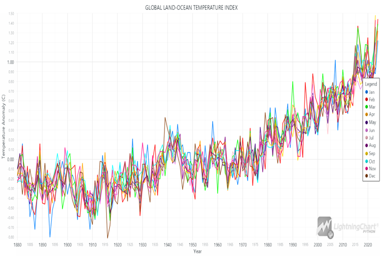
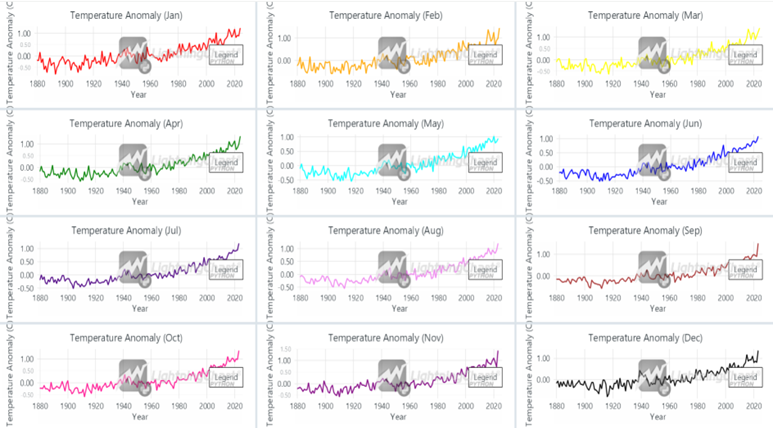

# Data Analysis Application of World Temperature Changes in Python
## Introduction
Global temperature changes over the past century have been a subject of extensive study and debate, given their profound implications on climate, ecosystems, and human life. Understanding these changes through data analysis helps to visualize trends, detect anomalies, and formulate predictive models. This article discusses the development of a Python application aimed at visualizing global temperature changes using various chart types to present comprehensive insights.
## Overview on Global Temperature Changes
The global average temperature has shown significant fluctuations and an overall increasing trend since the late 19th century. This trend is closely monitored due to its direct correlation with climate change, affecting sea levels, weather patterns, and biodiversity.
## Importance of Understanding World Temperature Changes
Analyzing temperature changes is crucial for several reasons:
- 	*Climate Change Mitigation*: Identifying trends helps in formulating strategies to mitigate adverse effects.
- 	*Environmental Policy*: Governments and organizations rely on this data to shape environmental policies.
- 	*Public Awareness*: Educating the public about climate trends promotes responsible behavior towards the environment.
## Python Data Analysis Application
A data analysis application in Python can efficiently process and visualize vast datasets, making it easier to interpret complex temperature trends.
### LightningChart Python
#### Overview
LightningChart is a high-performance charting library designed for creating interactive and dynamic visualizations. It supports a variety of chart types, each optimized for performance and clarity.
#### Features and Chart Types
- 1.	*Area Charts*: Ideal for showing cumulative data and trends over time.
- 2.	*Line Charts*: Useful for displaying continuous data, highlighting changes and trends.
- 3.	*3D Surface Charts*: Provide a three-dimensional perspective on data, offering a deeper understanding of complex datasets.
- 4.	*Multi-Line Charts*: Allow comparison of multiple datasets simultaneously, useful for monthly or regional temperature comparisons.
- 5.	*Dashboards*: Facilitate the organization of multiple charts in a single view, enabling comprehensive analysis and comparison across different time periods or data categories. Dashboards are particularly useful for visualizing monthly anomalies or other segmented data in a coherent and easily interpretable manner.

#### Performance Characteristics
LightningChart is optimized for handling large datasets with minimal performance overhead, ensuring smooth and responsive visualizations even with complex and extensive data.
### Setting Up Python Environment
#### Installing Python and Necessary Libraries
- 1.	*Python*: Ensure Python is installed. Visit python.org for the latest version.
- 2.	*Libraries*: Install required libraries using pip:
```
pip inatall paandas numpy lightningchart
```
#### Overview of Libraries
- 	*NumPy*: For numerical operations.
- 	*Pandas*: For data manipulation and analysis.
- 	*LightningChart*: For creating interactive and high-performance charts.
#### Setting Up Development Environment
Configure your IDE (e.g., PyCharm, VSCode) and ensure all libraries are properly installed. Load the dataset and preprocess it for visualization.
### Loading and Processing Data
#### Loading Data Files
Use Pandas to read data files. Here is an example:
```
import pandas as pd
data = pd.read_csv('path_to_your_file.csv')
data = pd.read_excel('path_to_your_file. xlsx')
```
#### Handling and Preprocessing Data
Ensure data is cleaned and formatted correctly. Handle missing values, convert data types if necessary, and prepare it for visualization.

### Visualizing Data with LightningChart
#### Introduction to LightningChart for Python
LightningChart offers a range of customizable charts. This powerful library is renowned for its high performance and ability to handle large datasets efficiently, making it ideal for complex data visualizations. Its advanced features and flexibility allow users to create highly interactive and engaging visualizations, ensuring that even the most intricate data can be easily understood. Here's how to create a few different types of visualizations.

## Creating the Charts
### 1. Area Chart   
```
import lightningchart as lc
import pandas as pd
# Read the license key
lc.set_license('my_license_key')
# Load the dataset
file_path = 'Land Ocean Temperature Index (C).xlsx'
data = pd.read_excel(file_path)
# Extract values
x_values = data['Year'].tolist()
y_values_no_smoothing = data['No_Smoothing'].tolist()

# Create the Area Chart
chart = lc.ChartXY(
    theme=lc.Themes.White,
    title='Global Temperature Changes (Area Chart)'
)

# Add Area Series
area_series = chart.add_area_series()
area_series.add(x_values, y_values_no_smoothing)
area_series.set_name('Temperature Anomaly')

# Customize x-axis
x_axis = chart.get_default_x_axis()
x_axis.set_title('Year')

# Customize y-axis
y_axis = chart.get_default_y_axis()
y_axis.set_title('Temperature Anomaly (C)')

# Open the chart
chart.open()

```


The area diagram clearly shows the trend of temperature changes from 1880 to 2020. Using this chart, you can easily see the temperature increase and sudden changes over time.
### 2. Line Chart 
```
# Extract values
x_values = data['Year'].tolist()
y_values_no_smoothing = data['No_Smoothing'].tolist()
y_values_lowess = data['Lowess(5)'].tolist()

# Create the chart
chart = lc.ChartXY(
    theme=lc.Themes.White,
    title='GLOBAL LAND-OCEAN TEMPERATURE INDEX'
)

# Add No_Smoothing series
no_smoothing_series = chart.add_line_series()
no_smoothing_series.add(x_values, y_values_no_smoothing)
no_smoothing_series.set_name('No Smoothing')
no_smoothing_series.set_line_color(lc.Color(0, 128, 255))  # Blue color
no_smoothing_series.set_line_thickness(2) 

no_smoothing_points = chart.add_point_series()
no_smoothing_points.add(x_values, y_values_no_smoothing)
no_smoothing_points.set_name('No Smoothing Points')
no_smoothing_points.set_point_shape('circle')
no_smoothing_points.set_point_color(lc.Color(0, 0, 255))
no_smoothing_points.set_point_size(6)

# Add Lowess(5) series
lowess_series = chart.add_line_series()
lowess_series.add(x_values, y_values_lowess)
lowess_series.set_name('Lowess(5)')
lowess_series.set_line_color(lc.Color(255, 0, 0))  # Red color
lowess_series.set_line_thickness(2)

lowess_points = chart.add_point_series()
lowess_points.add(x_values, y_values_lowess)
lowess_points.set_name('Lowess(5) Points')
lowess_points.set_point_shape('circle')
lowess_points.set_point_color(lc.Color(255, 0, 0))
lowess_points.set_point_size(6)

# Customize x-axis
x_axis = chart.get_default_x_axis()
x_axis.set_title('Year')

# Customize y-axis
y_axis = chart.get_default_y_axis()
y_axis.set_title('Temperature Anomaly (C)')

# Customize chart appearance
legend = chart.add_legend()
legend.add(no_smoothing_series)
legend.add(lowess_series)
legend.add(no_smoothing_points)
legend.add(lowess_points)

# Open the chart
chart.open()
```


The line graph shows the changes in the land-ocean temperature index. This graph is suitable for displaying continuous changes in temperature and can show long-term fluctuations and trends well The blue line with points represents the "No Smoothing" data, displaying annual temperature changes with all minor fluctuations and variability visible, while the red line with points represents the "Lowess(5)" smoothed data, providing a clearer view of the overall trend by reducing short-term fluctuations. The legend, located in the lower right corner, explains that "No Smoothing" indicates the raw annual data, and "Lowess(5)" shows the smoothed data. The chart reveals an overall increase in global temperatures from 1880 to 2020, with significant year-to-year variability visible in the blue line, and a consistent upward trend highlighted by the red line, especially noticeable from the mid-20th century onward. From 1880 to around 1940, the temperature anomalies show some variability with slight increasing trends; from the 1940s to the 1970s, there are periods of both warming and cooling with a relatively flat trend; and from the 1970s onward, the red line shows a sharp and continuous increase in global temperature anomalies, indicating accelerated global warming. The chart clearly distinguishes between raw data and smoothed data, making it easier to understand the underlying trend, and the use of points on both lines enhances the visibility of individual data points, with the legend providing clear and concise information about the different data series, aiding in the interpretation of the chart.
### 3. 3D Surface Chart
```
# Initialize LightningChart
chart = lc.Surface3D(
    data=temperature_grid.tolist(),
    min_value=np.min(temperature_anomalies),
    max_value=np.max(temperature_anomalies),
    min_color=lc.Color(0, 0, 255),  # Blue
    max_color=lc.Color(255, 0, 0),  # Red
    theme=lc.Themes.White,
    title='3D Surface Temperature Chart',
    xlabel='Year',
    ylabel='Temperature Anomaly',
    zlabel='Temperature (°C)'
)

# Set camera position for better view
chart.set_camera_location(1, 1, 2)

# Show plot
chart.open()
```


A 3D surface chart provides a more comprehensive view of temperature changes. Using this chart, you can examine the data more closely and more deeply and identify more complex patterns. The X-axis represents the years from 1880 to 2020, while the Y-axis indicates temperature anomalies in degrees Celsius, showing deviations from the long-term average temperature. The Z-axis represents the temperature values in °C. The color gradient from blue to red highlights the range of temperature anomalies, with blue indicating cooler anomalies and red representing warmer anomalies. The chart clearly demonstrates a trend of increasing temperature anomalies over the years, with the surface gradually rising from cooler (blue) to warmer (red) anomalies, particularly noticeable from the mid-20th century onward. This 3D visualization effectively emphasizes the pattern of global warming, illustrating the progression and intensification of temperature anomalies across the observed period. The grid pattern on the surface adds clarity to the year-by-year changes, while the smooth gradient transition offers a clear depiction of the warming trend. The camera angle and the 3D perspective provide a comprehensive view of the data, enhancing the visual impact of the long-term trend of rising global temperatures.
### 4.	Multi-Line Chart
```
# Create the chart
chart = lc.ChartXY(
    theme=lc.Themes.White,
    title='GLOBAL LAND-OCEAN TEMPERATURE INDEX'
)

# Add series for each month
months = ['Jan', 'Feb', 'Mar', 'Apr', 'May', 'Jun', 'Jul', 'Aug', 'Sep', 'Oct', 'Nov', 'Dec']

for i, month in enumerate(months):
    y_values = data[month].tolist()
    
    # Add line series for each month
    line_series = chart.add_line_series()
    line_series.add(x_values, y_values)
    line_series.set_name(month)
    line_series.set_line_color(colors[i])
    line_series.set_line_thickness(2)  # Set line width

# Customize x-axis
x_axis = chart.get_default_x_axis()
x_axis.set_title('Year')

# Customize y-axis
y_axis = chart.get_default_y_axis()
y_axis.set_title('Temperature Anomaly (C)')

# Customize chart appearance
chart.add_legend(data=chart)

# Open the chart
chart.open()
```


This chart visualizes the global temperature index from 1880 to 2020, with separate lines for each month to depict temperature anomalies in degrees Celsius. The X-axis represents the years, while the Y-axis indicates the temperature anomalies, showing deviations from the long-term average. Each month is color-coded for clarity . The chart demonstrates a clear trend of increasing temperature anomalies over the years, indicating a global warming pattern. Early years show more variability and lower anomalies, while recent decades exhibit higher anomalies and a more consistent upward trend. This comprehensive visualization highlights seasonal variations and the long-term trend of rising global temperatures, effectively illustrating the increasing temperature anomalies across different months and years.
### 5.	Dashboard for Monthly Temperature Anomalies
```
dashboard = lc.Dashboard(
    rows=4,
    columns=3,
    theme=lc.Themes.White
)

# List of month names
months = ['Jan', 'Feb', 'Mar', 'Apr', 'May', 'Jun', 'Jul', 'Aug', 'Sep', 'Oct', 'Nov', 'Dec']

# List of colors for each month
colors = [
    lc.Color(255, 0, 0),    # Red
    lc.Color(255, 165, 0),  # Orange
    lc.Color(255, 255, 0),  # Yellow
    lc.Color(0, 128, 0),    # Green
    lc.Color(0, 255, 255),  # Cyan
    lc.Color(0, 0, 255),    # Blue
    lc.Color(75, 0, 130),   # Indigo
    lc.Color(238, 130, 238),# Violet
    lc.Color(165, 42, 42),  # Brown
    lc.Color(255, 20, 147), # Deep Pink
    lc.Color(128, 0, 128),  # Purple
    lc.Color(0, 0, 0)       # Black
]

# Loop through each month and create a chart for it
for i, month in enumerate(months):
    # Extract data for the current month
    temperature_anomalies = data[month].tolist()
    
    # Create the chart
    chart = dashboard.ChartXY(
        column_index=i % 3,
        row_index=i // 3
    )
    chart.set_title(f'Temperature Anomaly ({month})')

    # Create the series
    series = chart.add_line_series()
    series.add(years, temperature_anomalies)
    series.set_name(month)
    series.set_line_color(colors[i])
    
    # Customize x-axis
    x_axis = chart.get_default_x_axis()
    x_axis.set_title('Year')
    
    # Customize y-axis
    y_axis = chart.get_default_y_axis()
    y_axis.set_title('Temperature Anomaly (C)')
    
    # Customize chart appearance
    chart.add_legend()

# Open the dashboard
dashboard.open()
```


This dashboard presents the global temperature anomalies for each month from January to December. The charts collectively demonstrate the overall warming trend, with most months exhibiting a noticeable increase in temperature anomalies over time, particularly in recent decades. This visualization effectively highlights the seasonal variations and long-term trends in global temperature changes.
## Customizing Visualizations
LightningChart allows extensive customization to enhance readability and aesthetics:
- 	Colors: Different colors for different datasets.
- 	Themes: Light and dark themes to suit preferences.
- 	Legends: Clearly label each series for better understanding.
## Conclusion
Developing a Python application for visualizing global temperature changes provides valuable insights into climate trends. LightningChart's robust features and performance make it an ideal choice for creating detailed and interactive visualizations.

## Benefits of Using LightningChart Python
- 	High Performance: Handles large datasets efficiently.
- 	Interactive Visualizations: Offers dynamic and engaging charts.
- 	Customization: Extensive options to tailor the visualizations as per needs.
## References
- 	NASA Global Temperature Data: [NASA](https://data.giss.nasa.gov/gistemp/) 
- 	Python Official Documentation: [Python](https://www.python.org/doc/)
- 	LightningChart Documentation: [LightningChart](https://lightningchart.com/python-charts/)
- 	Climate Change Data: [IPCC](https://www.ipcc.ch/)
